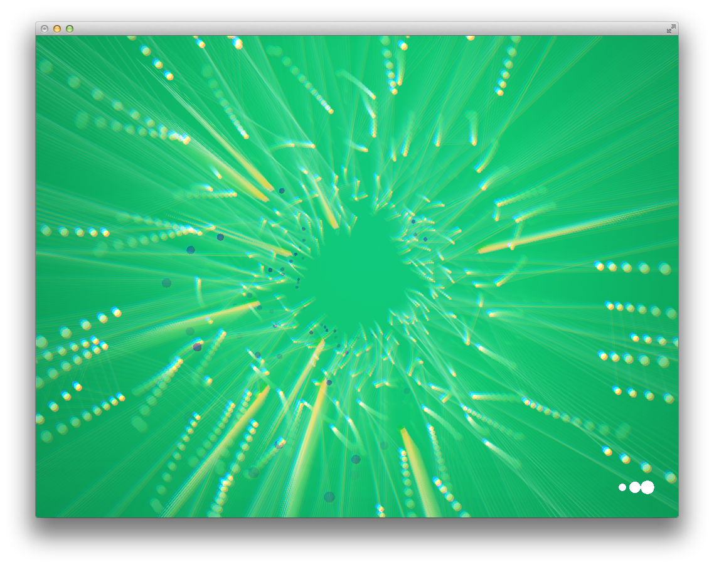

A very simple audio visualizer using openFrameworks for VBOs and FBOs, plus a couple of shaders and an FFT graph to calculate the beat frequencies.

[Youtube link](http://www.youtube.com/watch?v=LY1XJLa7U-4)